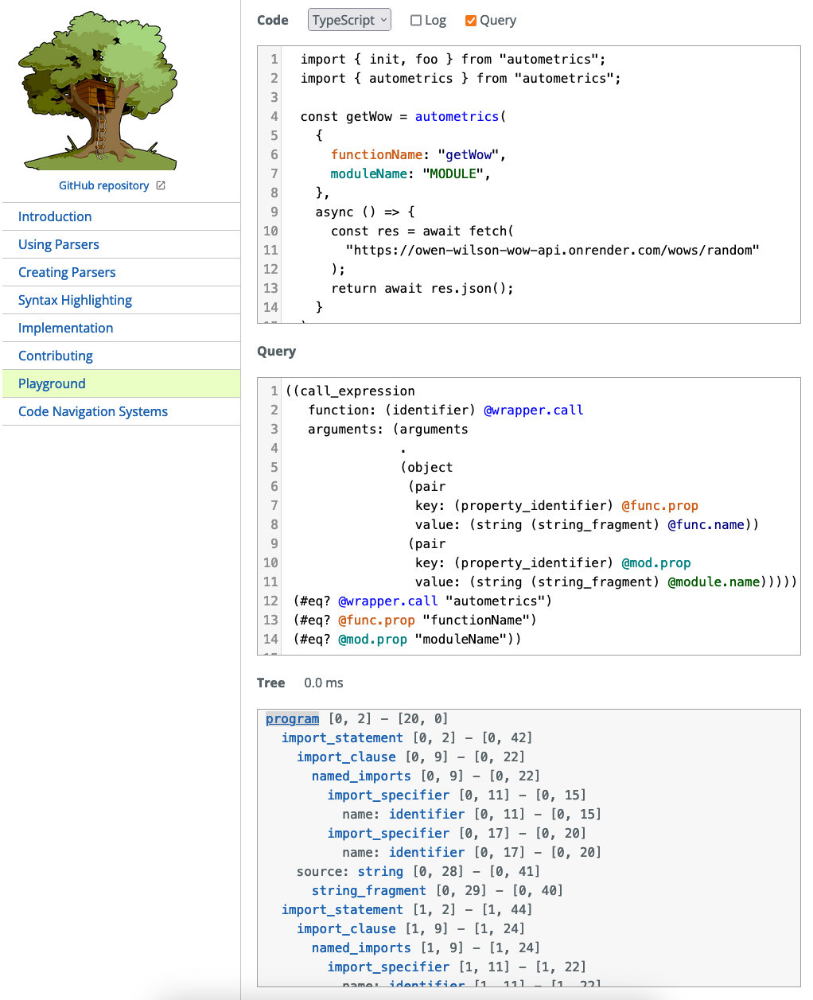

# Contributing

## Implementing language support

To add `am_list` support for a new language, you mostly need to know the usage
patterns of autometrics in this language, and understand how to make and use
tree-sitter queries.

### Function detection architecture

The existing implementations can also be used as a stencil to add a new
language. They all follow the same pattern:
- a `src/{lang}.rs` which implements walking down a directory and collecting the
`ExpectedAmLabel` labels on the files it traverses. This is the location where
the `crate::ListAmFunctions` trait is implemented.
- a `src/{lang}/queries.rs` which is a wrapper around a tree-sitter query, using
  the rust bindings.
- a `runtime/queries/{lang}` folder which contains the actual queries being
  passed to tree-sitter:
  + the `.scm` files are direct queries, ready to be used "as-is",
  + the `.scm.tpl` files are format strings, which are meant to be templated at
    runtime according to other detection happening in the file. For example,
    when autometrics is a wrapper function that can be renamed in a file
    (`import { autometrics as am } from '@autometrics/autometrics'` in
    typescript), we need to change the exact query to detect wrapper usage in
    the file.
    
### Building queries

The hardest part about supporting a language is to build the queries for it. The
best resources to create those are on the main website of tree-sitter library:

- the help section on [Query
  syntax](https://tree-sitter.github.io/tree-sitter/using-parsers#query-syntax)
  helps understand how to create queries, and
- the [playground](https://tree-sitter.github.io/tree-sitter/playground) allows
  to paste some text and see both the syntax tree and the current highlight from
  a query. This enables creating queries incrementally.


  
If you're using Neovim, it also has a very good [playground
plugin](https://github.com/nvim-treesitter/playground) you can use.

The goal is to test the query on the common usage patterns of autometrics, and
make sure that you can match the function names. There are non-trivial
limitations about what a tree-sitter query can and cannot match, so if you're
blocked, don't hesitate to create a discussion or an issue to ask a question,
and we will try to solve the problem together.

### Using queries

Once you have you query, it's easier to wrap it in a Rust structure to keep
track of the indices of the "captures" created within the query. It is best to
look at how the queries are used in the existing implementations and try to
replicate this, seeing how the bindings are used. In order of complexity, you
should look at:
- the [Go](./src/go/queries.rs) implementation, which has a very simple query.
- the [Typescript](./src/typescript/queries.rs) implementation, which uses the
  result of a first query to dynamically create a second one, and collect the
  results of everything.
- the [Rust](./src/rust/queries.rs) implementation, which uses dynamically
  created queries, but also uses a recursion pattern to keep track of modules
  declared in-file.

## Release management

The complete release cycle is handled and automated by the combination of `cargo-dist` and `cargo-release`.

When ready for a release, using `cargo release --(patch|minor)` or `cargo release NEW_MAJOR` should be enough.

### Prerequisites

Only `cargo-release` is needed to create a new release:
```console
$ cargo install --locked cargo-release
```

Also, you need to have the authorization to both:
- create and push tags on `release/*` branches in the Github repo
- create and push crates on `crates-io` registry for [`am_list` crate](https://crates.io/crates/am_list)

### Release a breaking `0.Y` version

- Create a branch `release/0.Y` from main
- Run `cargo release 0.Y.0` and make sure everything is okay

**If everything went ok**

- Run the same command, but with `--execute` flag

**If something went wrong**

- Nothing got actually published, so you can reset the `release/0.Y` branch to `main`,
- Then make and commit the changes on your `release/0.Y` branch (that is still local),
- Then try the `cargo release 0.Y.0` again.

### Release a new version on a release branch

In the example, we will push a new `0.2.3` version on `0.2`

- Create a release branch `rel_0.2.3` with all the changes that need to be included
  + new features are cherry-picked from `main`
  + bugfixes happen directly on the release branch (and later get cherry-picked _to_ `main` if relevant)
- Push the new branch `rel_0.2.3` and create a PR to `release/0.2`
- Prepare the release: `cargo release --no-publish --no-tag --allow-branch=rel_0.2.3 patch`
- Cleanup the `CHANGELOG.md` that got bad replacement patterns because of the 2-step process
- Push the new commits, and merge the PR
- Switch locally to `release/0.2` (the "main" release branch), and pull the latest changes
- Publish the tag and the new crate: `cargo release publish --execute && cargo release tag --execute && cargo release push --execute`

Bonus:
- Merge the CHANGELOG/README/CONTRIBUTING back from `release/0.2` to `main`
